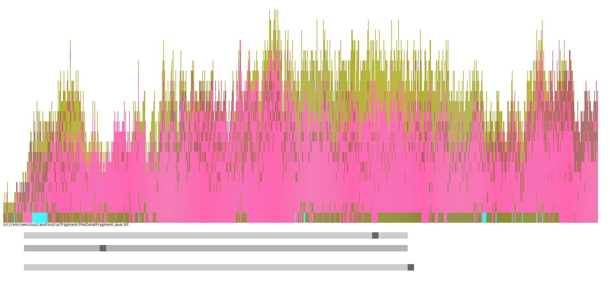

#VisioLine

####A visualization tool for understanding per line static attributes of a Git code repository.

With Visioline, we are visually representing per file and per line contributions to a code repository (based on Git commits). We do this by examining the annotation data of each line of code for each node in the commit tree. We can view this chronologically, showing the changes that happen over time. 

Being able to visualize the per line changes over time can be very useful for developers and project managers. In the context of object-oriented design, the [open/closed principle](https://en.wikipedia.org/wiki/Open/closed_principle) states that software entities (classes, modules, functions) should be open for extension but closed for modification. In this spirit, Visioline illustrates which lines of code are most frequently changed as a project grows, allowing developers to pinpoint sections in the code base which may be violating this design principle. Developers can also visually detect software modules which are [highly-coupled](https://en.wikipedia.org/wiki/Coupling_(computer_programming)) with each other. This may manifest itself visually when changes are made to many files in a single commit; this is another sign of suboptimal design. Finally, project managers can use Visioline to learn about the behaviour of their developers via commit patterns, and potentially detect conflicts between team members. 

**Usage:** The tool takes as input: source code and git check-in data. This can be achieved via the ```git blame``` command. 

#### Screenshot:




